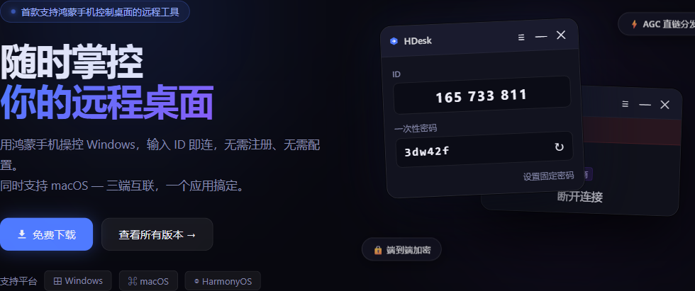
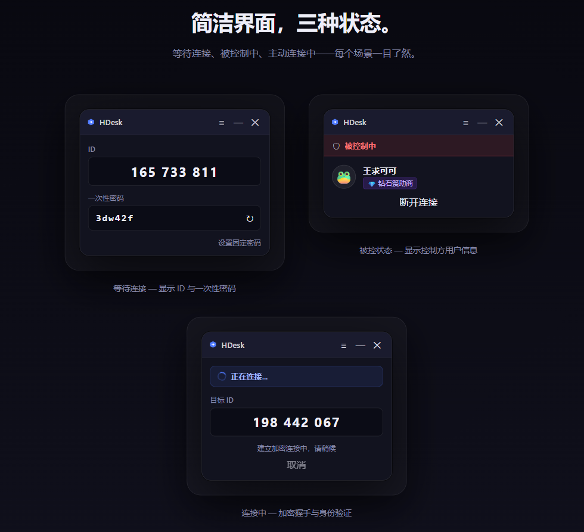
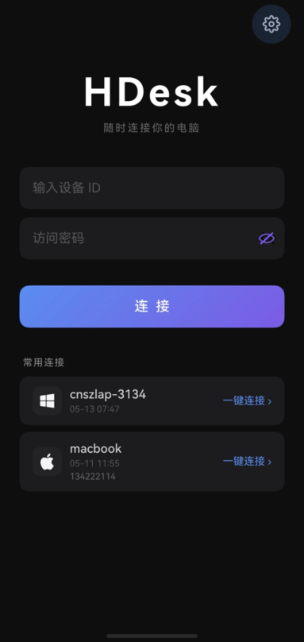
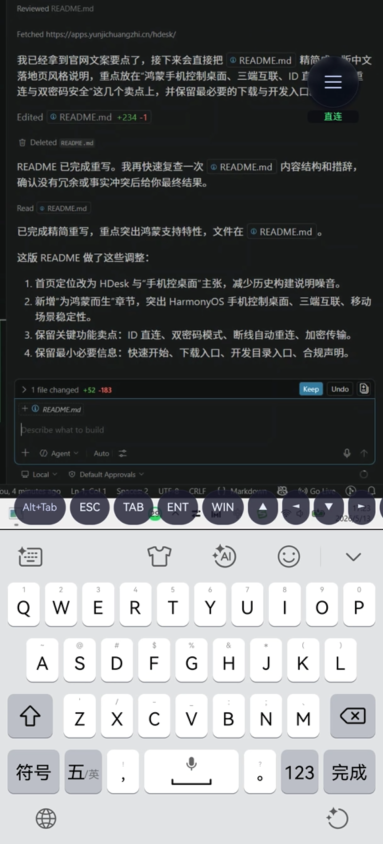

# HDesk — 远程桌面，极简重连

> 首款支持 **HarmonyOS 手机操控桌面**的远程工具  
> 用鸿蒙手机操控 Windows/macOS，ID 直连，无需注册、无需配置

<div align="center">



[官网](https://apps.yunjichuangzhi.cn/hdesk/) • [下载](https://releases.hdesk.yunjichuangzhi.cn/) • [问题反馈](https://github.com/rustdesk/rustdesk/issues)

</div>

## ✨ 核心优势

### 🔹 为鸿蒙而生

| 特性 | 说明 |
|:----:|------|
| **📱 鸿蒙手机控桌面** | 触摸直接映射为鼠标操作，手机可作为随身遥控器 |
| **🔗 三端无缝互联** | Windows、macOS、HarmonyOS 共用账号与最近连接记录 |
| **⚡ 移动弱网稳定** | 断线自动重连，切前后台状态完整保留 |

### 🔹 核心特性

| 特性 | 说明 |
|:---:|------|
| **🆔 ID 直连** | 输入 9 位设备 ID，无需 IP、无需端口映射 |
| **🔐 双密码模式** | 一次性密码 (自动刷新) + 固定密码 (长期授权) |
| **🛡️ 端到端加密** | 所有连接全程加密，AES-256 级别保护 |
| **⚙️ 开箱即用** | 安装即可用，无需复杂配置，自动启动服务 |

## 应用界面

### 桌面端

> 三种状态，一目了然




### 移动端（HarmonyOS）

| 已输入设备 ID | 默认首页 |
|:-------:|:-------:|
|  |  |
| 填入设备 ID 后可快速发起连接 | 查看最近设备并一键回连 |

## 快速开始

### 三步建立连接

```
1️⃣ 在被控端启动 HDesk
   ↓
   显示 9 位设备 ID + 一次性密码
   
2️⃣ 在控制端手机输入设备 ID + 密码
   ↓
   建立加密连接
   
3️⃣ 连接成功，开始远程操作
   ↓
   桌面完全控制，支持拖拽文件
```

### 系统要求

| 平台 | 最低要求 | 建议配置 |
|------|---------|---------|
| **Windows** | 10/11 (x64) | 处理器: i5+ / 内存: 4GB+ |
| **macOS** | 10.13+ (Intel/Apple Silicon) | 处理器: M1+ / 内存: 4GB+ |
| **HarmonyOS** | 3.0+ (手机) | 骁龙 870+ / 内存: 4GB+ |

### 使用场景

- 📱 **办公外出**：鸿蒙手机临时处理电脑文件、查看邮件
- 👨‍👩‍👧‍👦 **远程协助**：帮助家人/同事完成操作，实时语音沟通
- 🔄 **跨设备办公**：多设备切换，会话无缝接续
- 🎮 **内容消费**：将电脑画面投到手机，灵活浏览

## 下载与安装

### 官方发布

| 平台 | 版本 | 下载 |
|------|------|------|
| **Windows** | 安装版、便携版 | [发布页](https://releases.hdesk.yunjichuangzhi.cn/) |
| **macOS** | Universal (Intel/Apple Silicon) | 即将推出 |
| **HarmonyOS** | 鸿蒙手机控制端 | 即将推出 |

> 💡 **提示**：所有版本在发布页直链分发，无需注册，无需翻墙

### 安装步骤

1. 访问 [发布页](https://releases.hdesk.yunjichuangzhi.cn/) 下载最新版本
2. Windows 用户：双击安装或解压便携版
3. 启动后自动监听本地服务，显示设备 ID
4. 手机端输入 ID 发起连接即可

## 📊 功能对比

| 功能 | **HDesk** | 远程桌面 | TeamViewer | AnyDesk |
|:----:|:---:|:---:|:---:|:---:|
| **鸿蒙手机控制** | ✅ | ❌ | ❌ | ❌ |
| **ID 直连** | ✅ | ❌ | ✅ | ✅ |
| **端到端加密** | ✅ | ✅ | ✅ | ✅ |
| **文件传输** | ✅ | ✅ | ✅ | ✅ |
| **断线自动重连** | ✅ | ⚠️ | ✅ | ✅ |
| **开箱即用** | ✅ | ❌ | ⚠️ | ⚠️ |
| **完全离线可用** | ✅ | ✅ | ❌ | ❌ |
| **开源免费** | ✅ | ✅ | ❌ | ❌ |

## 🚀 开发与贡献

HDesk 基于 [RustDesk](https://github.com/rustdesk/rustdesk) 开源架构演进，采用 **Rust 后端 + Flutter 前端** 的跨平台方案。

### 📄 项目结构

```
rustdesk/
├─ src/              → Rust 核心（网络、编码、遥控）
├─ flutter/          → Flutter UI（桌面 & 移动）
├─ libs/             → 共享库（屏幕、输入、剪贴板）
├─ docs/             → 文档与构建脚本
├─ res/              → 资源文件
└─ AGENTS.md         → 开发指南
```

### 🚀 快速开始开发

```bash
# 1. 克隆仓库
$ git clone --depth 1 https://github.com/rustdesk/rustdesk.git
$ cd rustdesk

# 2. 查看开发文档
$ cat AGENTS.md                  # 开发指南
$ cat docs/CONTRIBUTING.md       # 贡献流程

# 3. 整理依赖下载
$ vcpkg integrate install        # Windows 必须
$ cargo build --release          # 编译应用

# 4. 或培训 Flutter 前端
$ flutter pub get
$ flutter run -d windows         # macOS/Linux 上占比提低
```

✨ **帮助**: 每个 PR 会介入 ✅ GitHub Actions CI/CD 自动测试。

### 🌟 贡献类型

| 类型 | 描述 | 贡献人 | 
|:---:|--------|:----:|
| **👨‍💻 代码** | 功能、修认、优化 | [PR](https://github.com/rustdesk/rustdesk/pulls) |
| **✍️ 编写** | 文档与翻译 | [Wiki](https://github.com/rustdesk/rustdesk/wiki) |
| **🐛 报告** | Bug 反馈与测试 | [Issues](https://github.com/rustdesk/rustdesk/issues) |
| **📋💡** | 功能建议 | [Discussions](https://github.com/rustdesk/rustdesk/discussions) |

🙏 我们永远欢迎不同背景的贡献者！

---

## 📢 反馈与支持

### 👥 社区与赞助

- **🌟 [GitHub Stars](https://github.com/rustdesk/rustdesk)** - 财空我们
- **🤝 [GitHub Sponsors](https://github.com/sponsors/rustdesk)** - 针对收益预算
- **🎫 [Patreon](https://www.patreon.com/rustdesk)** - 丕须非体成员
- **💳 [Open Collective](https://opencollective.com/rustdesk)** - 透明费用责

### 💬 社区氛围

- **💬 [GitHub Discussions](https://github.com/rustdesk/rustdesk/discussions)** - 社团络空室
- **🤖 [Reddit r/rustdesk](https://www.reddit.com/r/rustdesk)** - 旧版流汗
- **📧 [Discord](https://discord.gg/nDceKgxnkV)** - 实时聊天（活跃！）
- **👤 [X (Twitter)](https://twitter.com/rustdesk)** - 新闻流动

### 🏢 商业支持

- 👨‍💼 **企业授权** - 专用服务器、专业支持
- 🚀 **应事室茂住** - 地网部署、不失联网
- 💰 **吐槽反馈按月优化** - 根据但旧变变提需

📈 详见 [RustDesk Server Pro](https://rustdesk.com/pricing.html)

## 🔒 安全与隐私

### 加密传输

- **连接握手**：采用 ECDH 密钥交换，防止中间人攻击
- **数据传输**：所有流量使用 AES-256-GCM 加密
- **认证机制**：设备 ID + 动态密码双重验证

### 隐私保护

- ✅ 所有数据本地存储，不上云
- ✅ 连接记录仅保存设备端
- ✅ 无需账号注册，完全匿名
- ✅ 支持部署自有服务器

### 安全建议

1. 定期更新到最新版本
2. 使用复杂的固定密码进行长期授权
3. 不在公共网络上启动被控服务
4. 及时断开不需要的连接

---

## 📜 许可协议

本项目遵循 [GNU Affero General Public License v3.0](LICENSE)。

### ⚠️ 使用责任声明

HDesk **仅供合法授权的远程访问与运维**使用。任何违法使用者需自担全部法律责任：

❌ 禁止未经授权的设备控制  
❌ 禁止隐私数据采集与泄露  
❌ 禁止恶意软件分发  
❌ 禁止违反法律法规的活动  

开发者不为任何滥用行为负责。

## 🌟 感谢

> HDesk 致力于为全球 HarmonyOS 用户提供最便捷的远程协作工具。

**感谢**一下写得横竖的一些人、组织与社区：

- 🤖 [The Rust Foundation](https://foundation.rust-lang.org/) - 语言基准与优化
- 👤 [Flutter Team](https://flutter.dev/) - UI 框架与特特
- 👥 [RustDesk 社区](https://github.com/rustdesk/) - 一纳几林晓

---

## 📋 状态与最近更新

| 指标 | 状态 |
|:---:|:------:|
| **整体稳定性** | ✅ Production Ready |
| **跨平台支持** | 🙌 Windows / macOS / HarmonyOS |
| **开发活跃度** | 🐧 震震不窗 |
| **最后更新** | **2026.05** |
| **版本号** | 见 [Release Notes](https://releases.hdesk.yunjichuangzhi.cn/) |

---

<div align="center">

🌍 你的反馈有助于我们做得更好 🙏

[提交 Issue](https://github.com/rustdesk/rustdesk/issues) • [上报一个想法](https://github.com/rustdesk/rustdesk/discussions) • [功欣我们的 Star](https://github.com/rustdesk/rustdesk)

**春报春报，霜报霜报，翬感所有一直以来的支持者。**

</div>